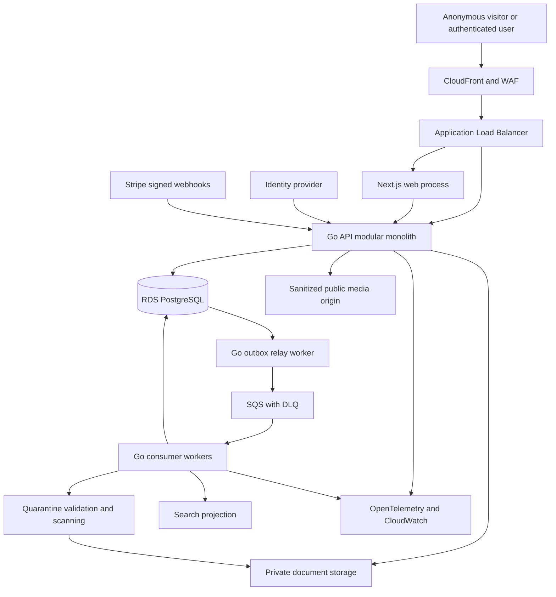

# System architecture

Original architecture proposal: 2026-09-16. Package A update: 2026-09-17. The target architecture below remains a design, except the implemented Go API/worker, workspace isolation and audit/outbox described in the [Package A runbook](../operations/PACKAGE-A.md) and ADRs 0002–0005. No cloud environment or public marketplace exists. Material decisions are tracked in [DECISIONS.md](DECISIONS.md).

## System boundary

The platform publishes and discovers business sale listings, manages authorized information exchange, records process evidence and charges for its own services. It does not execute legal business transfers, settle business purchase prices, provide escrow, adjudicate insolvency conduct, or claim that an identity check proves authority to sell.

Browsers, identity providers, Stripe and uploaded files are outside the application trust boundary. AWS services are infrastructure dependencies with least-privilege identities, not sources of application authorization. Search, email and analytical projections never replace transactional authority.

This is a logical topology, not deployable infrastructure. Bucket/account/region topology and ingress routing require D06. Public media can be delivered through CloudFront from a private S3 origin; “public media” does not mean a publicly accessible S3 bucket. The document delivery choice is separately gated by D05.

## Runtime and dependency rules

- `cmd/api` composes domain services, HTTP transport, pgx repositories and adapters. Standard `net/http` and explicit middleware are the default. API paths start at `/api/v1` once contracts exist.
- `cmd/worker` is independently runnable from the same Go module. Relay and consumer roles use explicit configuration and can run as separate ECS services with independent limits and IAM. No dependency on the web process being alive.
- `apps/web` renders public pages and supplies interaction. It uses generated TypeScript contracts. Server Components are not a second business-rule engine and do not bypass Go authorization by querying private tables.
- Module application services orchestrate use cases; domain rules are independent of HTTP, SQL, AWS and identity vendors. A narrow port is introduced for an actual dependency, not for every function.
- The composition root wires dependencies. No cross-module writes or direct access to another module's private repository. Shared transaction coordination is explicit for use cases that must commit atomically; avoid distributed calls inside SQL transactions.
- Technical primitives such as money, clocks, IDs and transaction handling have narrow packages when needed. Do not create a miscellaneous “common” domain or a module for every noun.

## Logical ownership map

These are intended responsibilities, not instructions to generate every directory now. Owner labels denote accountable roles to be assigned, not existing teams.

| Module | Owned responsibility | Primary boundary and owner role |
| --- | --- | --- |
| identity | Internal User, external subject links, authentication adapter | Identity vendor cannot grant domain permissions; Security owner |
| organizations | Organization, Workspace, Membership, permission evaluation | Workspace-scoped authority; Security/domain owner |
| listings | Business sale representations, Listing, versions, financial facts, lifecycle | Owns listing state and public release projection; Marketplace owner |
| verification | Evidence, claims, SellerMandate checks and validity | Identity, mandate and financial claims remain separate; Trust owner |
| marketplace | Cross-context public discovery orchestration, only when required | No second listing source of truth; Marketplace owner |
| search | SearchPort, normalized criteria, PostgreSQL/OpenSearch adapters | Reads approved public projection; Discovery owner |
| savedsearches | Buyer-owned criteria, notification preference and match state | Never stores only a browser URL; Discovery owner |
| documents | Upload, immutable document version, quarantine, classification, grant, access | Requires listing/workspace authorization; Security owner |
| messaging | Inquiry, Conversation, participants and messages | Explicit participant access across workspace boundaries; Marketplace owner |
| payments | Platform purchases, Stripe event inbox, entitlement facts | No listing-state mutations directly from webhook transport; Billing owner |
| advertising | Promotion, campaign placement and delivery events | Separate sponsored selection from organic search; Commercial owner |
| insolvency | InsolvencyCase, process facts, deadlines, offer evidence | No legal conclusions or auction engine; Domain/legal owner |
| audit | Durable, intentionally bounded AuditEvent records | Independent access and retention policy; Security/privacy owner |
| notifications | Delivery intent, localization, preference and retry | Recheck recipient access before dispatch; Operations owner |

Proposed module assignment: listing media presentation belongs to listings; the documents subsystem controls sensitive files. SellerMandate is a verification-owned authority record referenced by listing publication policy. Insolvency context references evidence; it does not silently bypass mandate checks. Payments owns purchase entitlement; listings owns whether that entitlement is sufficient for a transition. The eventual mandate workflow and responsible reviewers still require D07.

## Contracts and persistence

Public and protected APIs have distinct schemas and query paths. OpenAPI is reviewed before implementation; generated clients are derived artifacts. A public response cannot be made safe by removing a few fields from the private response at the frontend.

Proposed conventions for approved foundation work:

- Bounded request bodies, typed errors with stable English error codes and localized UI messages, correlation ID without stack traces or raw SQL in responses.
- Explicit opaque cursor pagination and stable tie-breaker; bounded filter lists and page sizes. Limits are configuration with documented rationale, not hidden business rules.
- Optimistic concurrency for mutable resources using an expected version/ETag; atomic predicate and conflict response. Test two writers against real PostgreSQL.
- Monetary API values use decimal strings for integer minor units plus currency to avoid JavaScript safe-integer truncation. Database values use checked integer minor units or an explicitly approved decimal type. Financial result may be negative; validation depends on the measure.
- Instants use RFC 3339 UTC representation and PostgreSQL `timestamptz`. Financial periods use explicit dates. A deadline additionally preserves IANA timezone and the entered local date/time; reject ambiguous/nonexistent local times unless an explicit offset resolves them.
- Shared-schema PostgreSQL, composite workspace ownership foreign keys, server-scoped queries and RLS are proposed under D02. Schema ownership is logical; migration role and runtime roles are distinct. No production runtime role owns tables or has `BYPASSRLS`.
- Forward-only applied migrations with checksums, one migration job per environment, advisory locking, expand/contract changes and bounded backfills. Restore is a recovery operation, not an automatic destructive down-migration.
- Use structured relational fields for universal listing facts and child records. Typed country extensions own jurisdiction-specific fields. JSON is reserved for versioned event payloads, normalized filter documents and bounded extension contracts, not the entire business model.

## Atomic command and event flow

The directive requires atomic business state and outbox intent. Proposed implementation mechanics under D04:

1. Resolve the authenticated internal or service actor and evaluate action/resource policy using current authoritative data. Internal workspace operations require active membership and permission; personal resources use User ownership, and approved buyer/resource grants need no seller-workspace membership. Public read paths are separately constrained to eligible projections.
2. Begin a database transaction with validated transaction-local ownership context appropriate to the operation. Revalidate predicates affected by concurrent permission/state changes inside the write boundary. Cross-party grants and system jobs use separately reviewed, narrowly scoped access paths, never a blanket tenant bypass.
3. Load/lock the relevant aggregate or update against its expected version. Execute an explicit application command, not arbitrary status SQL.
4. Write state, immutable material version if needed, bounded audit event and outbox event in the same transaction. Any failure rolls back all of them.
5. Commit; return the authoritative result. External delivery does not happen while holding the transaction open.
6. A relay claims outbox rows with short leases, publishes to SQS, then records delivery. A crash after sending but before recording deliberately permits duplicates. Expired leases can be retried.
7. A consumer uses a unique `(consumer_name, event_id)` receipt and local state changes in one transaction, acknowledging the queue only after commit. External effects require their own durable delivery record/idempotency key; a database receipt alone cannot make email exactly once.

Event envelope: event ID, event name and schema version, aggregate ID and version, workspace ID where owned, occurrence time, correlation/causation IDs, and a minimal typed payload. Do not put uploaded content, credentials, signed URLs, identity evidence or unrestricted free text on queues. Consumer code uses event schema versions; malformed/unsupported versions are quarantined rather than silently discarded.

Consumers tolerate out-of-order versions: stale projection updates cannot overwrite newer versions; gaps trigger authoritative reload or controlled rebuild. Ordering requirements for a particular process must be stated explicitly. “Published to queue” and “side effect completed” are distinct observable states.

## Search and public consistency

SearchPort conceptually accepts versioned `SearchCriteria`, sort and cursor, and returns public summaries, a next cursor and explicit result metadata. Organic results and sponsored placements are separate collections. No actual method signature is frozen before contract review.

The PostgreSQL adapter starts with filtered relational queries and, where justified, full-text indexes over released public content. Deterministic ordering includes an immutable unique tie-breaker; normalization and adapter behavior have a shared test suite. No external engine is required to publish or find listings correctly. Load tests, query plans and relevance evaluation justify OpenSearch later.

The public release projection must be approved independently of the draft. Projection schema is an allowlist with no private joins. For discovery, stale results can be tolerated only within agreed product/security limits. Confidentiality and withdrawal are different: protected or withdrawn content must not keep being served from an index or shared cache merely because asynchronous invalidation is delayed. D10 requires authoritative eligibility checks plus a bounded cache strategy before public launch. Where an absolute immediate revocation guarantee is needed, cacheable disclosure is inappropriate.

Saved searches contain normalized versioned criteria and user-owned notification preferences, not URLs. Matching deduplicates per saved-search/listing/version policy, rechecks current public eligibility and recipient access, and honors pauses/unsubscribe at delivery. Frequency and material-update matching semantics are product decisions.

## Failure isolation

| Failure | Intended behavior | Evidence required |
| --- | --- | --- |
| PostgreSQL unavailable | Readiness fails; protected reads/writes fail safely; liveness does not cause cascading restarts | Dependency outage test |
| SQS/relay unavailable | State commits with durable outbox; alert on backlog; no claim of completed delivery | Crash/retry and backlog test |
| OpenSearch unavailable | Defined PostgreSQL fallback where capacity is proven, or explicit bounded unavailability | Adapter/failure test; no silent incomplete results |
| Scanner unavailable | Documents remain quarantined, retries bounded, alarm raised | Timeout and poison-file tests |
| Identity provider unavailable | No new sign-in; existing session treatment follows approved policy | Auth outage test |
| Stripe unavailable | No fabricated entitlement; reconcile durable payment state after recovery | Duplicate/out-of-order event tests |
| Audit insert fails | Material mutation fails atomically; denied-action security events have separate bounded durable path | Fault injection |
| Email unavailable | Retry delivery intent; do not roll back a completed listing transition | Delivery idempotency test |

## Planned physical structure

Create only the portions required by approved work: `apps/web`, `cmd/api`, `cmd/worker`, owning packages under `internal`, `db/migrations`, `db/queries`, `api/openapi`, `infra/terraform`, `scripts`, and `tests` for cross-module scenarios. Documentation exists now; these runtime paths are not created by this design package.

## Verified technical references

Checked 2026-09-16. The [Go release page](https://go.dev/dl/) reports Go 1.27.1 as stable; recheck and pin the supported patch and build image when implementation starts. [Next.js support policy](https://nextjs.org/support-policy) and [self-hosting guidance](https://nextjs.org/docs/app/guides/self-hosting) must guide supported version selection and multi-instance cache handling; exact package versions are not selected here. [PostgreSQL version policy](https://www.postgresql.org/support/versioning/) must be reconciled with actual RDS region support before engine selection.

[PostgreSQL RLS documentation](https://www.postgresql.org/docs/current/ddl-rowsecurity.html) documents owner/superuser bypasses and integrity-check caveats; RLS therefore complements application authorization rather than proving it. [AWS outbox guidance](https://docs.aws.amazon.com/prescriptive-guidance/latest/cloud-design-patterns/transactional-outbox.html) supports transactional event intent; [SQS standard queue guidance](https://docs.aws.amazon.com/AWSSimpleQueueService/latest/SQSDeveloperGuide/standard-queues.html) requires duplicate and ordering tolerance. The architecture choices above are proposals derived for this product, not claims those references prescribe the full system.
