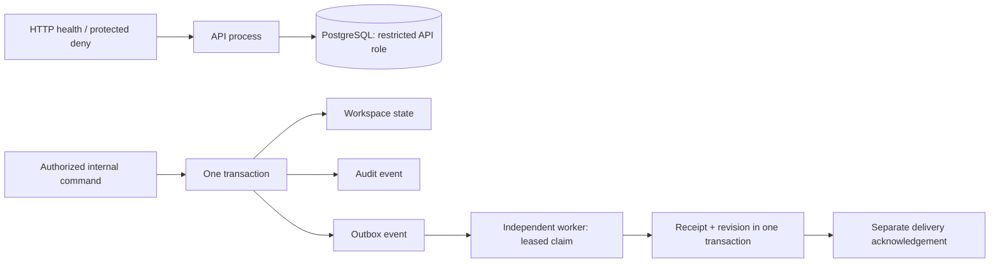

# Package A runtime and recovery runbook

Implemented scope: P0.1–P0.3, approved 2026-09-17. Exact acceptance results are in the [completion report](PACKAGE-A-REPORT.md). This runbook describes the local backend foundation; it does not authorize production deployment or later work packages.

## Runtime boundaries

`cmd/api`, `cmd/worker` and `cmd/migrate` build independently. The API and worker share reviewed persistence code and a PostgreSQL database, but use different restricted logins. Neither performs startup migrations. The API exposes operational health and denies all protected `/api/v1` requests: no production authentication adapter or account-management endpoint exists. Actor, role and workspace headers never establish identity.

The protected internal application operations are reading a workspace and changing its name at an expected version. They require a trusted internal user ID, active user and active explicit workspace membership with the relevant permission. A managing owner or organization member receives no implicit access. These functions are exercised with synthetic identities in integration tests; they are not an exposed unauthenticated API.

The worker maintains a private workspace revision projection from durable outbox events. That is a real PostgreSQL effect, storing a workspace ID and monotonic version, without copying workspace names or introducing listing functionality. PostgreSQL dispatch is implemented now; AWS SQS integration remains part of the unimplemented target architecture.



## Build and local verification

Use Go 1.27.1 and PostgreSQL 18.6 for the recorded checks. See [Windows tooling](../../scripts/dev/TOOLING.md) for the pinned toolchain, synthetic database setup, restricted test roles and credential handling. Credentials are generated locally into ignored, user-restricted `.tools/local-postgres`; do not print them or commit that directory.

```powershell
./scripts/dev/Bootstrap-Windows.ps1
./scripts/dev/Start-LocalPostgres.ps1
. ./scripts/dev/Set-LocalTestEnvironment.ps1
go run ./cmd/migrate apply
./scripts/dev/Configure-TestRoles.ps1
go build -o .tools/api.exe ./cmd/api
go build -o .tools/worker.exe ./cmd/worker
go build -o .tools/migrate.exe ./cmd/migrate
```

Run each process in its own terminal after loading the local test environment. Set `DATABASE_URL` to `TEST_API_DATABASE_URL` for the API, and `TEST_WORKER_DATABASE_URL` for the worker. Run the relevant executable. Set `HTTP_ADDR=127.0.0.1:8080` for the API and `HTTP_ADDR=127.0.0.1:8081` for the worker health listener. Both processes require an explicit listen address. Ctrl+C triggers bounded graceful shutdown. Never use the migration or test administrator identity as a runtime login.

For scanners and complete verification:

```powershell
$env:GOBIN = Join-Path (Get-Location) '.tools/bin'
go install golang.org/x/vuln/cmd/govulncheck@v1.8.0
go install github.com/securego/gosec/v2/cmd/gosec@v2.29.0
# Install gitleaks 8.30.1 from its official release and verify its published checksum.
python -m venv .tools/contracts
./.tools/contracts/Scripts/python.exe -m pip install -r scripts/requirements-checks.txt
$env:PATH = "$env:GOBIN;$(Join-Path (Get-Location) '.tools/gitleaks');$(Join-Path (Get-Location) '.tools/contracts/Scripts');$env:PATH"
./scripts/verify.ps1
./scripts/dev/Stop-LocalPostgres.ps1
```

`scripts/verify.ps1` requires all three test DSNs and enforces `REQUIRE_INTEGRATION=1`. Go tests alone may skip database suites without those variables; such a run cannot satisfy Package A acceptance. Store and migration suites create randomly named disposable databases and remove only those databases. API and worker composition suites use the configured, migrated synthetic `foundation_test` database. All these suites use actual PostgreSQL. `.tools/evidence` contains raw local test/scanner evidence and is ignored; durable result summaries belong in the delivery report. GitHub Actions configuration exists, but publishing it and remote execution still require D13.

## Configuration and health

`DATABASE_URL` is mandatory. URI host, database, user and `sslmode` must be explicit. Deployed connections require `sslmode=verify-full`; `disable` is accepted only for literal loopback addresses or `localhost`. Identity overrides through URI query parameters and duplicate TLS mode parameters are rejected. Standard pgx/libpq environment and credential/certificate defaults still apply to unspecified connection properties; deployment configuration must control those explicitly. Never log a DSN.

Typed durations, retry settings, HTTP bounds are validated before startup. Defaults and exact configuration names are defined and tested in `internal/config`; they are engineering defaults, not approved production SLOs. Separate startup, request, readiness and shutdown deadlines prevent unbounded waits. Structured JSON logs carry bounded error codes and generated request IDs; request bodies, credentials and database error text are omitted.

`GET /health/live` reports process liveness. `GET /health/ready` checks the actual required database relation under a bounded context and fails during shutdown or dependency failure. The [OpenAPI contract](../../api/openapi/package-a.json) documents these endpoints. Health endpoints reveal no database diagnostics. The worker exposes the same health endpoints on its separate configured listener, validates startup dependencies and periodically logs measured pending/processing/delivered/dead counts and the oldest outstanding age. Dead events and processing failures produce error-level records. Production metric export, alarms and trace export are not implemented.

## Migration operations

Run `cmd/migrate apply` with a separately configured `MIGRATION_DATABASE_URL`. It obtains a session advisory lock, verifies contiguous filenames and SHA-256 history, and applies each migration plus its ledger row in a PostgreSQL transaction. A modified applied migration is rejected. Never edit an applied file: add a new reviewed forward migration. No automatic destructive rollback is provided.

The migration creates NOLOGIN capability roles; separately provision login identities that inherit exactly the API or worker capability. Runtime startup rejects current or inherited superuser, BYPASSRLS, role/database administration, broad built-in data/file access, table ownership, or mixed API/worker capabilities. The migration administrator remains privileged and outside the runtime isolation boundary.

Do not infer rollback from a connection failure during commit. Reconnect and inspect durable schema history before retrying migration work. For a workspace command, reread its version before retrying; optimistic concurrency prevents silent overwrite, but command-level request deduplication is not implemented. Worker redelivery uses durable consumer receipts.

## Outbox recovery

Claims use `FOR UPDATE SKIP LOCKED`, database-clock deadlines and unique lease tokens. Processing transactions lock the leased event and commit the consumer receipt and monotonic revision effect together. Acknowledgement is separate: a crash between effect and acknowledgement safely repeats the delivery and finds the existing receipt. Reordered older events cannot regress the projection.

Retry delay is bounded exponential backoff, capped at one minute. Unsupported envelopes and exhausted events become `DEAD`; they remain durable and observable. Expired leases recover. If the last permitted attempt already committed its receipt, recovery marks the event delivered; otherwise it dead-letters it. Lowering the configured attempt budget also resolves exhausted pending rows. This is at-least-once delivery with transactional idempotent effects, not exactly-once processing.

For a dead event, inspect only authorized operational metadata, identify and fix the cause, and use a reviewed migration/repair procedure with separate administrative authority. No unreviewed automatic replay, deletion or admin HTTP endpoint exists. Receipt/event retention is intentionally not automated: deleting receipts can defeat deduplication. D08 must settle retention and privacy before real data is admitted. Audit immutability is enforced for runtime roles, not against a privileged database administrator.

## Scope limits

No UI, listings, identity vendor/session workflow, role-management interface, documents, payments, public search, AWS resources, SQS transport, containers, OpenTelemetry export or production operations are delivered. No sensitive customer data is required for verification. The existing architecture/security documents remain the target design unless a specific implementation and passing evidence are recorded. A fresh journey-specific Mobbin pass remains mandatory before any future user-facing interface.
